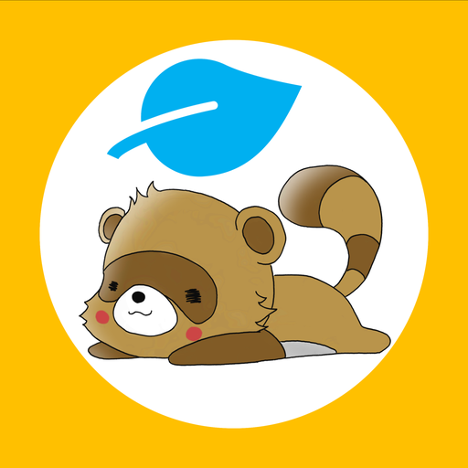
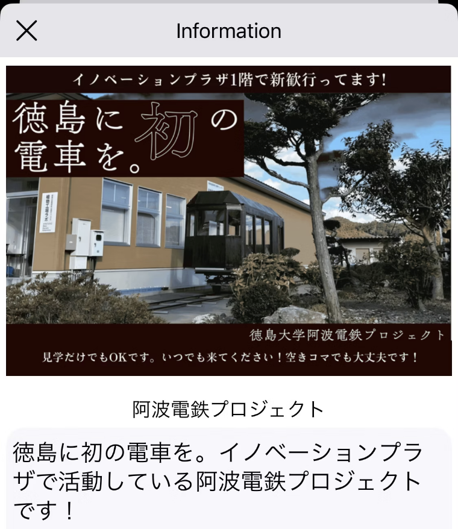
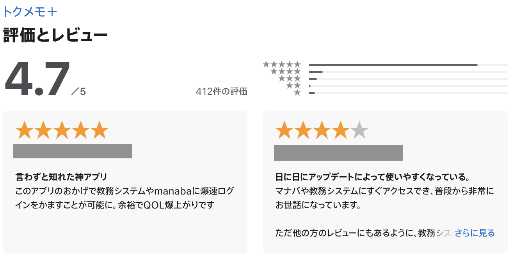
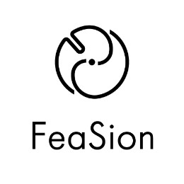

<h1 style="text-align: center;">個人開発で徳島大学生60％以上の心を<br>掴んだアプリ・そして手放した話</h1>

<div class="author-info">
  <div class="profile-container">
    
    <div class="profile-text-area">
      <div class="profile-text-main" style="text-align: center;">Sansan株式会社<br>@akidon0000 (あきどん)</div>
    </div>
  </div>
</div>

---
こんにちは、**あきどん**です。昨年まで私は徳島大学で化学を専攻していました。そんな私が、たった一人でアプリを開発し、学生の60%以上に愛用されるサービスを作り上げ、最終的に企業へ譲渡することになった物語をお話しします。

## 「不便」とともに歩んだキャンパスライフ

大学生活に必要な情報—講義資料、履修登録、成績確認、図書館の開館情報 etc… そのすべてが、バラバラのウェブサイトに散らばっています。90分の講義を受けるために、講義前に資料をダウンロードし、講義後に小テストを受ける。20分ほどでログアウトするため、1日に何度もログインを繰り返す日々。年に一度、大学側から強制されるパスワード更新は、かえって覚えやすい簡単なパスワードを使いたくなる状況を生み出していました。

## 「なければ、自分で生み出す」― すべては一つの想いから

<div style="display: flex; align-items: center; gap: 20px;">
  <div style="flex: 1;">
    「なぜ、もっと便利にならないんだ？」「なぜ、誰もやらないんだ？」それが、すべての始まりです。
    今の状態のような壮大な計画があったわけではなく、ただ自分や友人たちが毎日直面している「面倒くさい」を、自分の手で解決したかったのです。特に、何度も求められるログインの手間をなくし、誰もが複雑で安全なパスワードを気兼ねなく使えるようにしたい。その一心で、「トクメモ」の開発をスタートすることにしました。
  </div>
  <div style="flex: 0 0 auto; text-align: center;">
    <br>
    <span style="font-size: 0.7em; color: #555;">3代目のトクメモ＋のアイコン</span>
  </div>
</div>

## ゼロから切り拓いた、自動ログインへの道

最初の壁は技術的な問題です。徳島大学のシステムには当然ながら開発者向けAPIが存在せず、独学の私には何から始めればいいのか分からない状況でした。
「このままでは何もできないのでは？」と不安になりつつも、大学ウェブサイトの「シングルサインオン（SSO）」の仕組みとWKWebViewを活用することで、HTML側にJavaScriptを送りこみ手動でのログイン作業を再現する方法で解決することに。

```swift
func webView(_ webView: WKWebView, didFinish navigation: WKNavigation!) {
    let url = self.webView.url!
    let jsCode = "document.getElementById('username').value='{{ID}}'"
    if url.contains({{ログイン入力が必要な画面のURL}}) {
        webView.evaluateJavaScript(jsCode)
    }
}
```

## 口コミから始まった、静かな革命

アプリを作っただけでは意味がない――そう気付いたのは、リリース後しばらく経ってからのことです。どれだけ便利なものでも、使ってくれる人がいなければ価値は生まれません。そこで私は、アプリの魅力をより多くの人に届けるため、大学非公認の学生団体を立ち上げ、広報や機能拡充に本格的に取り組み始めました。

<div style="display: flex; align-items: center; gap: 20px;">
  <div style="flex: 0 0 auto; text-align: center;">
    <br>
    <span style="font-size: 0.7em; color: #555;">トクメモ＋での広告欄</span>
  </div>
  <div style="flex: 1;">
大学教授と連携し、教授の要望を取り入れた機能をアプリに実装することで、教授自身が学生にアプリを紹介してくれるような仕組みを構築。さらに、学生同士を繋げるための学生向け広告・部活動一覧機能・新歓カレンダー機能・文化祭機能・大学ニュース機能なども積極的に追加。メンバーそれぞれの得意分野を活かしてGASによる定期更新処理や、ラズパイを活用した学生向け広告配信システムの構想、P2Pを使った過去問や掲示板の構想など、広報や機能拡充を推進していきました。<br>
そして、アプリの存在や便利さをより多くの学生に知ってもらうため、友人同士で紹介し合えるような仕掛けや、サークル・部活動・イベントなど学内コミュニティと連携した広報活動にも力を入れました。
  </div>
</div>
<div style="display: flex; align-items: center; gap: 20px;">
  <div style="flex: 1;">
こうした取り組みの結果、「口コミ」が自然に生まれ、友人から友人へと広がっていきます。気がつけば月間アクティブユーザーは3,500人を超え、徳島大学学部生の約6割が利用するアプリへと成長。心からの喜びと同時に、大きな責任も感じるようになりました。
  </div>
  <div style="flex: 0 0 auto; text-align: center;">
    <br>
    <span style="font-size: 0.7em; color: #555;">「神アプリ」「QOLが爆上がり」嬉しい声が続々と</span>
  </div>
</div>

## 「大学公認アプリ」への挑戦と現実

かつて「トクメモ＋」を徳島大学の公認アプリとして認めてもらえないかと、大学側に打診したことがあります。公認となれば、学生にとって「トクメモ＋」に学生IDやパスワードの入力をする不安材料が減り、より多くの学生に安心して使ってもらえるのではないかと考えたからです。また、大学公認アプリを対外的にアピールすることで、大学側にも一定のブランド向上効果などメリットがあるのではと期待していました。<br>
しかし、実際に情報センター長へ連絡しましたが、「学務室へ」「広報室へ」と担当部署を紹介され、最終的には「過去に他大学で学生作アプリによる個人情報漏洩の事例があり、同様のリスクがあるため公認はできない」と断られました。

その後も諦めず、個人情報はサーバーに保存せず端末内に公式推奨の方法で保管していることや、アプリの利用実績・アンケート結果なども資料として再度提案しました。しかし、「問題が起きた場合の責任の所在が不明確」「大学として学生に責任を負わせることはできない」「教員が責任者になる必要があるが、引き受ける教員がいない」といった理由で、最終的に公認化は実現せず。<br>
このような経緯から、合同会社やNPO法人の設立も検討しましたが、運営費の負担や継続性、後継者への引き継ぎのしやすさなどを考慮した結果、最終的には学生サークルという形で運営を続けることに。

## コストの壁　日々痩せ細っていく自分の財布

学生にとって、サーバー維持費やApple税は大きな負担です。大学生向けのアプリだからこそ、学生にとって不要な企業広告は一切載せず、完全無料で提供することにこだわりました。そのため、学生サークルとしての収入はゼロ。そこで、コストが発生するものはすべて廃止し、無料で使えるサービスを組み合わせて、運用費「ゼロ」を目指すことにしました。
（Apple Developer Programには教育機関向けプランもありますが、大学側が学生を招待する必要があり、そのためには大学公認アプリであることが条件です）

静的な情報はGitHubでJSON形式で管理し、定期的な処理はGoogle Apps Scriptで自動化する方針にしました。
API通信については、microCMSなどの無料プランも検討しましたが、複数サービスを利用すると従量課金による予期せぬ費用発生や、引き継ぎ時のアカウント移行の難しさ、サービスごとの使い方の属人化など、学生運用ならではのリスクがあると判断。最終的にGitHubリポジトリ上にJSONファイルを置き、クライアント側から直接取得する方法を選びました。これなら学生エンジニアでも学習コストなく、簡単に修正・運用できます。
また、アプリ内で表示している「部活動一覧機能」など一部Webページも純粋な HTML‧CSS で自作し、GitHub Pagesで公開しています。

徳島大学では、特定のライブラリや技術に精通した学生を探すよりも、プログラミングに興味を持つ学生を巻き込み、育てていく方が現実的で確実だと感じています。そのため、環境構築やキャッチアップ、修正のコストを最小限に抑え、誰でも簡単に参加・貢献できるようにしています。

## 自分がいなくなっても、価値が続くように

大学公認アプリ化は叶わず、後継体制づくりも難しい中、卒業を前に「アプリを終了する」か「譲渡する」かの選択を迫られます。しかし、譲渡するにしても、しっかりと運用を続けてくれる保証がある相手でなければ意味がありません。

そんな中、企業への譲渡という案が浮かび、イベントやX（旧Twitter）での交流を通じて徳島県内の社長と相談するようになります。最終的には、徳島県のスタートアップ企業（株式会社FeaSion）と何度も話し合いを重ね、譲渡を決断することになりました。

<div style="display: flex; align-items: center; gap: 20px;">
  <div style="flex: 0 0 auto; text-align: center; display: flex; flex-direction: column; align-items: center; justify-content: center;">
    
    <span style="font-size: 0.7em; color: #555;">https://feasion-website.pages.dev/</span>
  </div>
  <div style="flex: 1;">
    譲渡にあたっては、以下の要望を提示し、受け入れていただきました。<br>
    ・学生が今後も開発に関わり続けられる仕組みを共に構築する<br>
    ・営利目的での運用は行わない<br>
    ・収益が発生した場合は可能な限り学生に還元する<br>
    こうして、私がいなくなってもアプリの価値が受け継がれていく仕組みを作ることができました。
  </div>
</div>

## 学生が開発に関わり続けるために

徳島県内の大学生を対象としたLTイベント「ヒマ会」を企画し、スポンサーとしてFeaSionに協力いただきました。学生主導のイベントから新たな開発メンバーを発掘できる仕組みを整えることができました。

しかし、ここで新たな課題が浮上します。それは「初学者には開発・運用が難しい構成」と「学生エンジニアのモチベーション維持」という2つの壁です。

### UIKitからSwiftUIへフルリプレイス

SwiftUIが登場したのは2019年です。最近の学生エンジニアの多くはSwiftUIから学び始めており、UIKitはむしろ新規学習者にとって負担が大きい状況にあります。さらに、最新技術を取り入れることで開発へのモチベーション向上にもつながると考え、「新しい技術に触れたい」という学生の意欲を後押しできるよう、SwiftUIへの全面的なリプレイスを決断することにしました。


### アーキテクチャもシンプルに Model+Viewへ刷新

これまではRxSwiftを用いたオレオレMVVM構成でアプリを開発していましたが、新しく参加する学生にとって学習コストが高く、キャッチアップが困難な課題がありました。そこでSwiftUIへの移行に際し、ModelとViewのみのシンプルな構成へ刷新し、ファイルやディレクトリの数を減らし、初学者でも迷わず理解しやすいコードベースを目指すことに。テストもModel層のユニットテストのみに絞り、UIやプレゼンテーションロジックの確認は実機テストで行う方針とすることで、初心者が参加しやすい環境を整備。

リリース自動化（CICD）も検討しましたが、頻度やメンテナンス負担を考え、手動リリース用ドキュメントで対応する方針に。広告配信は、以前のGitHub管理から、SSSAPIを使いスプレッドシートの内容をAPI化する方法に切り替え、非エンジニアでも簡単に更新作業が行えるようになりました。

## 優しいデータ移行手順

譲渡に際しては技術的な課題も発生しました。iOSアプリでは、開発者アカウントが変更されるとKeychainの参照先も変わってしまい、これまで保存していたデータにアクセスできなくなるという問題があります。具体的には、Keychainの情報は< App ID Prefix >.< Bundle ID >に紐付けられており、< App ID Prefix >はアカウントごとに異なるため、アプリを譲渡すると全ユーザーが強制的にログアウトされ、再設定が必要になってしまいます。この問題を解決するため、以下のような移行手順を採用しました。
1. **譲渡前の最終アップデート**: Keychainのデータを一時的に暗号化してUserDefaultsに保存するアップデートを配信
2. **譲渡後の新アプリ**: アプリ起動時にUserDefaults内の暗号化データを検知し、新しいKeychainへ復元した後、UserDefaultsのデータを削除するアップデートを配信

このような裏側での移行処理により、ユーザーは普段通りアプリをアップデートするだけで、意識することなく新しい体制へとスムーズに移行することができました。

## この経験から、伝えたいこと

このアプリは今も学生と企業が協力して運営しています。身近な「不便」は、自分たちの手で解決できる。一人からでも価値あるものは作れる。この経験が、何かを始めたい学生の背中を押せたら嬉しいです。

---

<div style="display: flex; align-items: center; gap: 20px;">
  <div style="flex: 0 0 auto; text-align: center;">
    <br>
    <span style="font-size: 0.7em; color: #555;">トクメモ＋についてのQiita記事</span>
  </div>
  <div class="profile-container">
    
    <div class="profile-text-area">
      <div class="profile-text-main">@akidon0000 (Sansan株式会社)</div>
    </div>
  </div>
</div>
